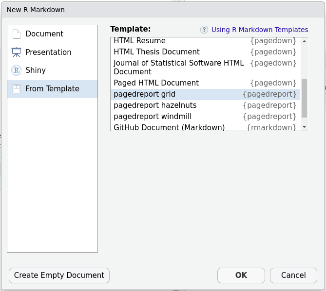

# Pagedreport and Pagedown to generate pretty reports in R

This repository contains a basic tutorial on the usage of the R packages *pagedown* and *pagedreport*.

Please refer to the authors website of both packages for more details:

-   pagedown: <https://pagedown.rbind.io/>
-   pagedreport: <https://pagedreport.rfortherestofus.com/>
-   Great intro and tutorials:
    -   <https://rfortherestofus.com/2022/11/no-designer-needed/>
    -   <https://rfortherestofus.com/2021/01/announcing-pagedreport/>

## Example report

This is an example report (pagedreport grid) in R Markdown using pagedreport:

-   [example_report.Rmd](example_report.Rmd) 

This is the knitted output in PDF format:

-   [example_report.pdf](example_report.pdf) 

## Install

The package *pagedown* is in CRAN, to install it just run this command in the R console:

``` r
install.packages("pagedown")
```

The package *pagedreport* is not in CRAN, to install it from the R console:

``` r
remotes::install_github("rfortherestofus/pagedreport", ref = "main")
```

If the *remotes* object is not installed, install it from the R console:

``` r
install.packages("remotes")
```

### Dependencies

In Ubuntu based operating systems, the following dependencies might need to be installed from the system's console:

-   rsvg

```         
sudo apt install librsvg2-dev
```

-   magick

```         
sudo apt install libmagick++-dev
```

-   curl

```         
sudo apt install libcurl4-openssl-dev
```

## Create a new report from template

In R Studio, to create a new report starting from a *pagedreport* template follow these steps:

|    |    |
|------------------------------------------------------------|-----------------------------------------------------|
| 1.  Create a new **R Markdown** file.               |  2.  Select a *pagedreport* template from the R Markdown dialog window. |

